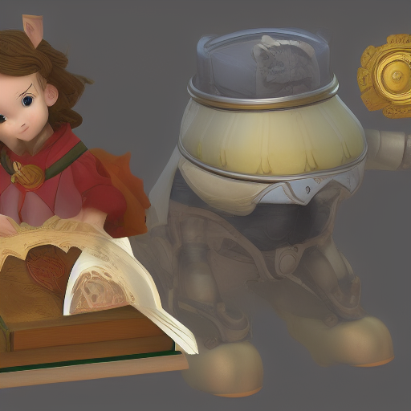
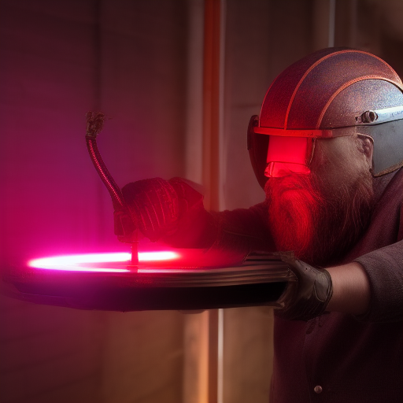

How to run Stable Diffusion 1.5 on Lichee Pi Console 4A

## Build instructions

1. clone repository [OnnxStream](https://github.com/vitoplantamura/OnnxStream) 
2. clone repository [XNNPACK](https://github.com/google/XNNPAK) 
3. Select revision as per OnnxStream build instructions: ```git checkout 579de32260742a24166ecd13213d2e60af862675``` 
4. build XNNPACK
5. edit OnnxStream/src/CMakeLists.txt and change "-march=native"
   to "-march=rv64gcv0p7_zfh" 
6. build OnnxStream as outlined in the build instructions
7. Download the weights and decompress in the models directory from:
   [OnnxStream github](https://github.com/vitoplantamura/OnnxStream/releases/wonload/v0.1/STableDiffusion-OnnxStream-Windows-x64-with-weights.rar) an unpack
8. Get [merge.txt](https://huggingface.co/runwayml/stable-diffusion-v1-5/reseolve/main/tokenizer/merges.txt) and copy to <Model Dir>/SD/tokenizer/
9. Delete sd.exe and replace with "sd" from step 6
10. Enjoy

## Some sample results

|    Prompt                                |     Result                  |
|------------------------------------------|-----------------------------|
| An astronaut riding a horse oon Mars     |   |
| A grey sky over a futuristic port city   |   |
| A wizard with olive skin holding a grimoire with a mechanical pig familiar |   |
| A wizard with olive skin holding a book with a small pig companion |   |
| A dwarf engineer with a copper helmet assembling a cyberpunk neon display |   |
| A street in Innsmouth during Christmas time. A few vaguely fish-looking people are walking by.|   |
| A remote street in a small New England town during Christmas time. A few people are walking by, avoiding to look at each other. |   |

